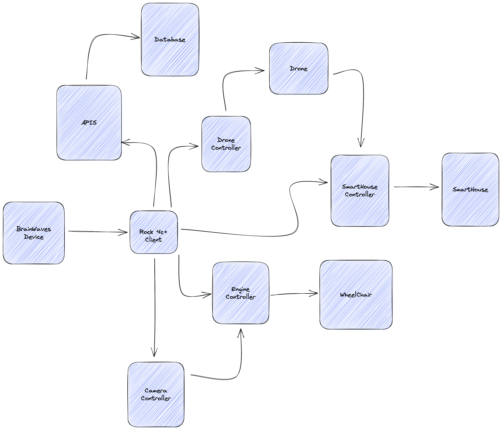

# Wheelchair BrainWaves Application

This application is for helping people on wheelchair.
More info soon
## Run Application

In root folder:

`pnpm i`

`docker compose up`

To run server:
`cd apps/apis && npm run start`

To run ui:
`cd apps/ui && npm run start`

## Technologies

* UI
  * React
  * typescript
* Apis
  * Nestjs
  * Typescript

## Architecture

### Global Overview

More information about architecture:
[Extended Architecture](./docs/ARCHITECTURE_MODULES_EXTENDED.md)