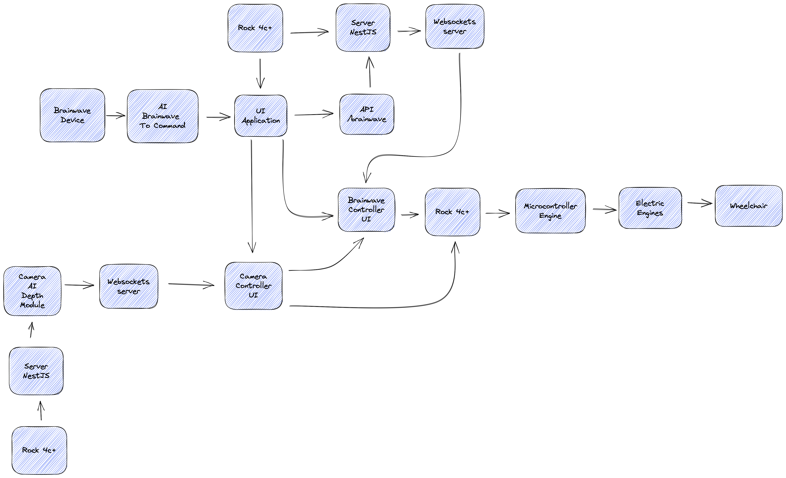

# Architecture modules extended - WIP

This project consists of three architecture modules: Brainwave module, Camera module, and Drone module.

## Brainwave module

The Brainwave module is responsible for processing signals received from the human brain and interpreting them into actions. It consists of three main components: EEG sensors, signal processing algorithms, and machine learning models.

The EEG sensors are attached to the user's scalp and record the electrical signals generated by the brain. These signals are then processed using signal processing algorithms that filter out noise and extract relevant features. The processed signals are then fed into machine learning models that learn to recognize patterns in the signals and interpret them into actions.

The extended architecture of the Brainwave module includes additional machine learning models that improve the accuracy of the system in interpreting signals from the brain. The module also includes a feedback loop that allows the system to adapt to changes in the user's brain signals over time.

## Camera module

The Camera module is responsible for capturing visual information from the environment and sending it to the system for analysis. It consists of a camera, image processing algorithms, and machine learning models.

The camera captures images of the environment, which are then processed using image processing algorithms that filter out noise and extract relevant features. The processed images are then fed into machine learning models that learn to recognize objects and patterns in the images.

The extended architecture of the Camera module includes additional machine learning models that improve the accuracy of the system in recognizing objects and patterns in the images. The module also includes a feedback loop that allows the system to adapt to changes in the environment over time.

## Drone module

The Drone module is responsible for controlling the movement of the drone based on the signals received from the Brainwave module and the visual information received from the Camera module. It consists of a flight controller, motor drivers, and communication interfaces.

The flight controller receives commands from the Brainwave module and uses them to control the movement of the drone. The motor drivers control the speed and direction of the drone's motors. The communication interfaces allow the module to communicate with the Brainwave and Camera modules.

The extended architecture of the Drone module includes additional sensors that improve the accuracy of the system in detecting obstacles and avoiding collisions. The module also includes machine learning models that learn to predict the movement of objects in the environment and adjust the movement of the drone accordingly.

